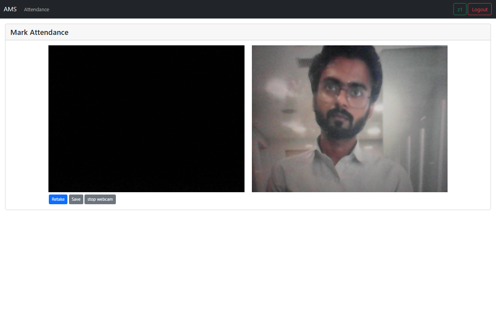

# AMS (Attendance Management System)

In this project we initialized Attendance for Staff and Manager can take Attendance by capturing their photo.

[Live Example](https://ams-mauve.vercel.app)

# AMS (Attendance Management System)

In this project Staff and Manager can take Attendance by capturing their photo. uses Local Stroge

# Roles

## 3 Roles introduced

1. Super Admin
2. Manager
3. Staff

### Super Admin
Super Admin Can See All User and also see thier Attendance and change their detail. can add Manager as well as Staff. And Update Master List and change Master list like Shift, Working Time and Working Days in Setting Page. Only Super admin Allowed to visit setting Page.

### Manager 
Manager only allowed to add Staff by adding their details. can see thier attendance withe captured image.

### Staff

Staff Only see and mark their attendance.

# Pages
1. Login Page
2. Dashboard
3. Staff
4. Attendance
5. Mark Attendance
6. Setting

### Login Page

User have to login with their email and password, which filled
at the time of user creation. currently password change and encryption has not be included in this project.

### Dashboard

In Dashboard User Can see their detail and Also See how many page they can visit. it is differ from role to role.
#### Staff

#### Manager

#### Super Admin

### Staff

In Staff, Manager can see all their Staff which is created by their self. and also change staff detail but not name and password.

there is also add button if wantend to add more user.

Super Admin can see all user and change their details as well 

### Attendance
In Attendance, Staff See thier attendance. and mark- theri attendance as well.

Super Admin Manager also can see Staff attendance along with captured Image.

### Mark Attendance

By capturing, thier photo user can mark thier attendance.

### Setting

Only Super Admin can visit the page. And add Working time, Working Days and Shift.

#### Not included
 `Password Change functionality.`,
 `Day to Day Basis attendance, commented the code for testing purpose.` ,`Dynamic Roles Creation is not implemented`, `User Permission Form not created`

### Not included

Email: superadmin@ams.com
Password:123456

All User password is 123456

